<!-- docs/architecture.md -->

# Architecture

## Database Choice

This project uses PostgreSQL with Prisma.

PostgreSQL was chosen because the core domain is relational: bills have versions, bills move through stages, users follow bills, and MP activity may reference legislative records. Prisma is used as the TypeScript ORM so database models, migrations, and queries stay type-safe and easier to maintain.

Raw scraped source data is preserved using JSON fields where needed, so the app can keep official source payloads without forcing every scraped field into a rigid schema immediately.

## Core Database Design

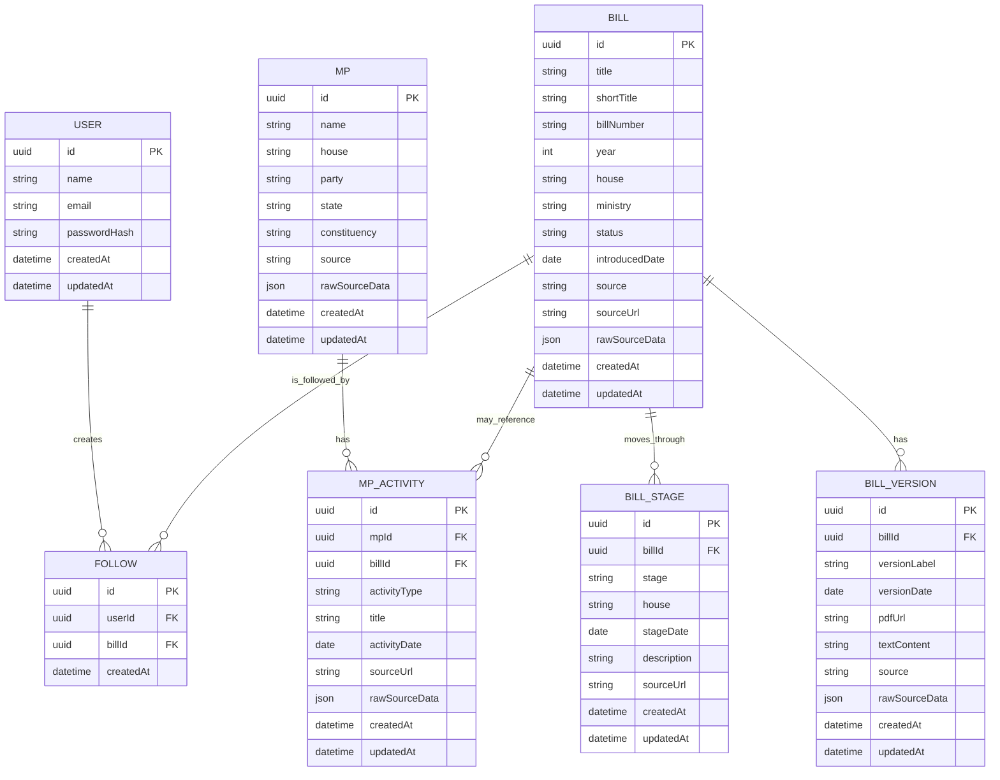

## Table Responsibilities

### `bills`

Stores the main legislative bill record.

Key responsibilities:
- bill identity
- title and bill number
- house, year, ministry, and current status
- official or source URL
- raw scraped source payload

### `bill_versions`

Stores different text versions of a bill, such as introduced, amended, passed, or committee versions.

This table supports the version diffing feature.

### `bill_stages`

Stores timeline events for a bill.

Examples:
- introduced in Lok Sabha
- passed in Lok Sabha
- introduced in Rajya Sabha
- referred to committee
- received assent

### `users`

Stores application users for authentication.

Passwords are stored as hashes, never as plain text.

### `follows`

Join table connecting users to bills they follow.

A user can follow many bills, and a bill can be followed by many users.

### `mps`

Stores Member of Parliament profile data from the seed dataset.

### `mp_activity`

Stores MP-related legislative activity.

This is separate from `mps` because one MP can have many activity records, and some activity records may reference bills.

## Backend Folder Responsibilities

The API is organized by responsibility so routes, request handling, business logic, database access, and background jobs do not all live in one file.

### `apps/api/src/server.ts`

Application entrypoint.

Responsibilities:
- creates the Express app
- registers global middleware such as CORS and JSON parsing
- mounts route modules
- registers not-found and error handlers
- starts the server on the configured port

Every incoming HTTP request enters the Express app through `server.ts`.

### `apps/api/src/config`

Configuration and shared infrastructure.

Current files:
- `env.ts`: loads and validates environment variables using `dotenv` and `zod`
- `prisma.ts`: creates and exports the shared Prisma client

This keeps environment access and database client setup out of route, controller, and service files.

### `apps/api/src/routes`

URL definitions.

Route files decide which controller function handles each HTTP method and path.

Examples:

```ts
router.get("/", listBills);
router.get("/:id", getBillDetail);
router.get("/:id/timeline", getBillTimelineDetail);
```

When mounted in `server.ts` like this:

```ts
app.use("/api/bills", billRoutes);
```

the final API paths become:

```text
GET /api/bills
GET /api/bills/:id
GET /api/bills/:id/timeline
```

### `apps/api/src/controllers`

HTTP request and response handling.

Controllers:
- read route params from `req.params`
- read query params from `req.query`
- read JSON bodies from `req.body`
- validate request input
- call service functions
- return JSON responses
- pass errors to centralized error middleware

Controllers should not contain raw database queries. They coordinate HTTP-level behavior.

### `apps/api/src/services`

Business logic and database access.

Services:
- use Prisma to query or update PostgreSQL
- contain reusable app logic
- stay independent of Express request and response objects

Example request path:

```text
GET /api/bills
  -> bills.routes.ts
  -> listBills controller
  -> getBills service
  -> prisma.bill.findMany()
  -> PostgreSQL
```

Keeping services separate makes the code easier to test, reuse, and explain.

### `apps/api/src/middleware`

Reusable Express middleware.

Current files:
- `error.middleware.ts`: creates `AppError`, handles unknown routes, and returns consistent JSON errors
- `auth.middleware.ts`: verifies JWTs and attaches the authenticated user to `req.user`

Middleware runs before or after controllers depending on its purpose.

### `apps/api/src/jobs`

Scripts that run outside the normal HTTP request/response flow.

Current job files:
- `seed-bills.ts`: seeds initial bill, stage, and version data
- `seed-mps.ts`: seeds initial MP profile and activity data

Jobs are useful for scraping, scheduled fetches, seeding, and background processing.

### `apps/api/prisma`

Database schema and migrations.

Current files:
- `schema.prisma`: Prisma models, fields, relationships, indexes, and unique constraints
- `migrations/`: SQL migration history generated by Prisma

The Prisma schema is the source of truth for the database structure.

## API Request Flow

The backend uses a route-controller-service structure. Each layer has a specific responsibility, so HTTP handling, business logic, and database access stay separate.

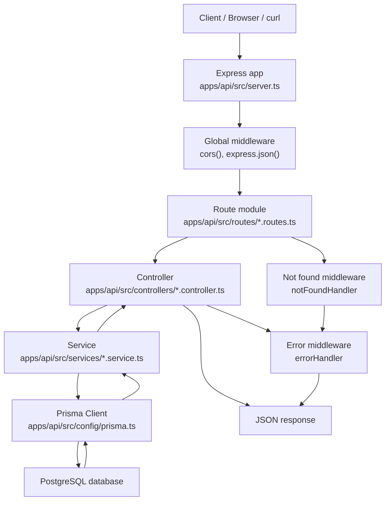

### What Happens At Each Stage

1. The client sends an HTTP request, such as `GET /api/bills`.

2. `server.ts` receives the request through the Express app.

3. Global middleware runs first:
   - `cors()` allows frontend/backend communication.
   - `express.json()` parses JSON request bodies.

4. Express matches the request to a route module.

   Example:

   ```ts
   app.use("/api/bills", billRoutes);
   ```

5. The route file maps the HTTP method and path to a controller.

   Example:

   ```ts
   router.get("/", listBills);
   router.get("/:id", getBillDetail);
   router.get("/:id/timeline", getBillTimelineDetail);
   ```

6. The controller reads request inputs from `req.params`, `req.query`, or `req.body`.

7. The controller calls a service function.

   Example:

   ```ts
   const bills = await getBills(filters);
   ```

8. The service uses Prisma to query or update PostgreSQL.

   Example:

   ```ts
   prisma.bill.findMany()
   ```

9. Prisma sends the query to PostgreSQL and returns typed data back to the service.

10. The controller sends a JSON response.

    Example:

    ```json
    {
      "data": []
    }
    ```

11. If no route matches, `notFoundHandler` creates a 404 error.

12. If any controller or service throws an error, `errorHandler` returns a consistent JSON error response.

    Example:

    ```json
    {
      "error": {
        "message": "Bill not found",
        "statusCode": 404
      }
    }
    ```

## Authentication And Authorization Flow

The backend uses JWT-based authentication.

Authentication answers:

```text
Who is this user?
```

Authorization answers:

```text
Is this user allowed to access this route or resource?
```

At this stage, the app has authentication and route protection. More specific authorization rules can be added later.

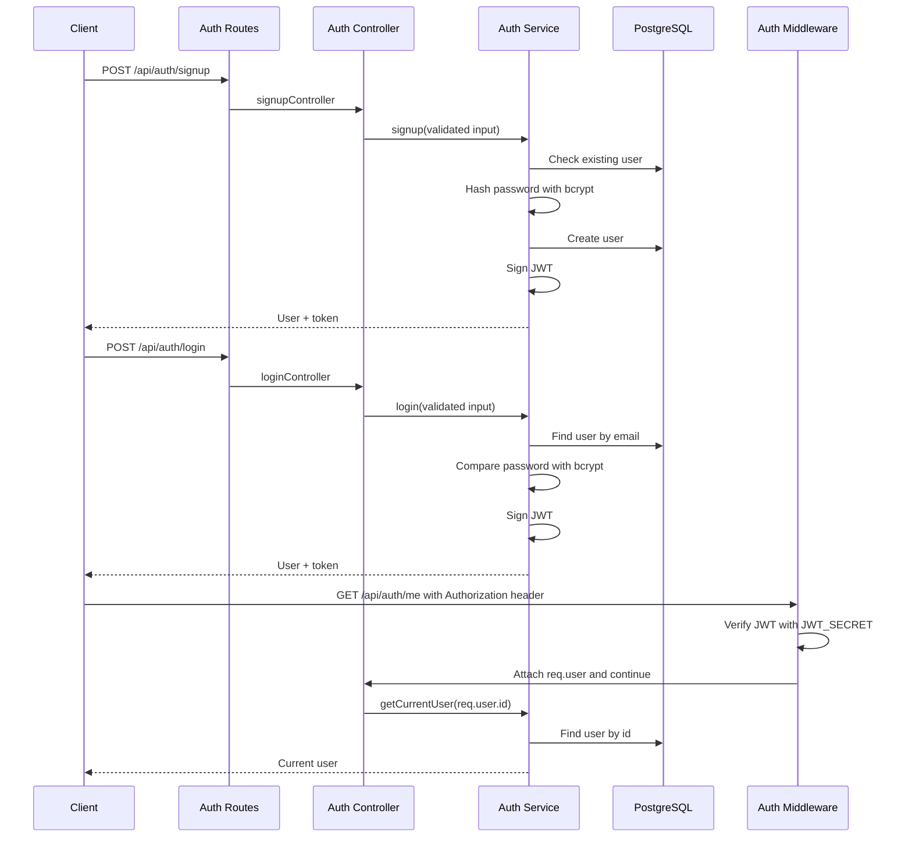

### Signup

The signup flow:

1. Client sends `name`, `email`, and `password`.
2. Controller validates the request body with Zod.
3. Service checks whether the email already exists.
4. Password is hashed with bcrypt.
5. User is stored in PostgreSQL.
6. A JWT is signed and returned with the safe user object.

The plain password is never stored.

### Login

The login flow:

1. Client sends `email` and `password`.
2. Controller validates the request body with Zod.
3. Service finds the user by email.
4. bcrypt compares the submitted password with the stored password hash.
5. If valid, the backend signs a JWT.
6. The client receives the safe user object and token.

For invalid credentials, the API returns a generic error:

```text
Invalid email or password
```

This avoids revealing whether an email exists.

### What The JWT Contains

The JWT payload currently contains:

```json
{
  "sub": "user-id",
  "email": "user@example.com"
}
```

`sub` means subject and stores the authenticated user's ID.

The token is signed using `JWT_SECRET`, which is loaded from environment variables. The secret is not committed to Git.

The token also has an expiration time:

```text
7 days
```

### How Protected Routes Work

Protected routes use the `requireAuth` middleware.

The client sends the token in the `Authorization` header:

```text
Authorization: Bearer TOKEN_HERE
```

The middleware:

1. Reads the `Authorization` header.
2. Confirms it starts with `Bearer`.
3. Extracts the token.
4. Verifies the token using `JWT_SECRET`.
5. Reads the user ID from `sub`.
6. Attaches the authenticated user to `req.user`.
7. Allows the request to continue.

If the token is missing, invalid, or expired, the middleware returns `401 Unauthorized`.

Example protected request flow:

```text
GET /api/auth/me
  -> requireAuth middleware
  -> verify JWT
  -> attach req.user
  -> getMeController
  -> getCurrentUser service
  -> PostgreSQL
  -> JSON response
```

### Why JWT Is Useful Here

JWT lets the frontend authenticate once, store the token, and send it with later requests.

This is useful for features like:
- viewing the current logged-in user
- following bills
- listing followed bills
- sending notifications to users who follow a bill

The backend still checks the database for `/api/auth/me`, so deleted users or stale tokens do not return outdated user data.

## Follow Route Flow

Follow routes are protected user-specific actions.

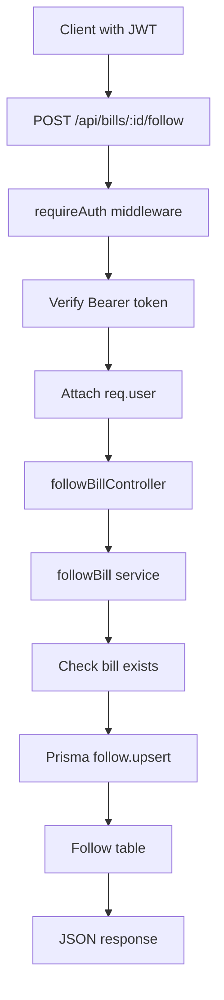

### Follow

The follow endpoint is:

```text
POST /api/bills/:id/follow
```

It uses the authenticated user ID from `req.user`, not from the request body.

This prevents one user from following bills on behalf of another user.

The service uses the compound unique key:

```prisma
@@unique([userId, billId])
```

and Prisma `upsert`, so following the same bill more than once does not create duplicate rows.

### Unfollow

The unfollow endpoint is:

```text
DELETE /api/bills/:id/follow
```

It uses `deleteMany` with both `userId` and `billId`.

This makes unfollow safe to retry. If the follow row does not exist, the request still completes without crashing.

### My Follows

The current-user follows endpoint is:

```text
GET /api/me/follows
```

It returns all bills followed by the authenticated user, including selected bill details needed by the frontend.

## Frontend Architecture

The frontend is a Next.js app inside `apps/web`.

The frontend does not connect to PostgreSQL directly. It communicates with the Express backend through HTTP APIs.

```text
Next.js frontend
  -> Express API
  -> Prisma
  -> PostgreSQL
```

### Frontend Folder Responsibilities

#### `apps/web/app`

Next.js App Router routes and layouts.

Current important files:
- `layout.tsx`: root layout shared by all pages
- `page.tsx`: bill list homepage at `/`
- `bills/[id]/page.tsx`: dynamic bill detail page at `/bills/:id`
- `globals.css`: global styling and shared utility classes

#### `apps/web/components`

Reusable UI components.

Current components:
- `bill-card.tsx`: displays one bill in the bill list
- `bill-timeline.tsx`: renders visual stage timeline for a bill
- `auth-panel.tsx`: handles login/logout UI and token persistence
- `follow-bill-panel.tsx`: handles follow/unfollow interaction for one bill

#### `apps/web/lib`

Frontend utilities and API clients.

Current file:
- `api-client.ts`: centralizes calls from the frontend to the Express API

The API client reads the backend base URL from:

```env
NEXT_PUBLIC_API_BASE_URL=http://localhost:4000
```

### Frontend Page Flow

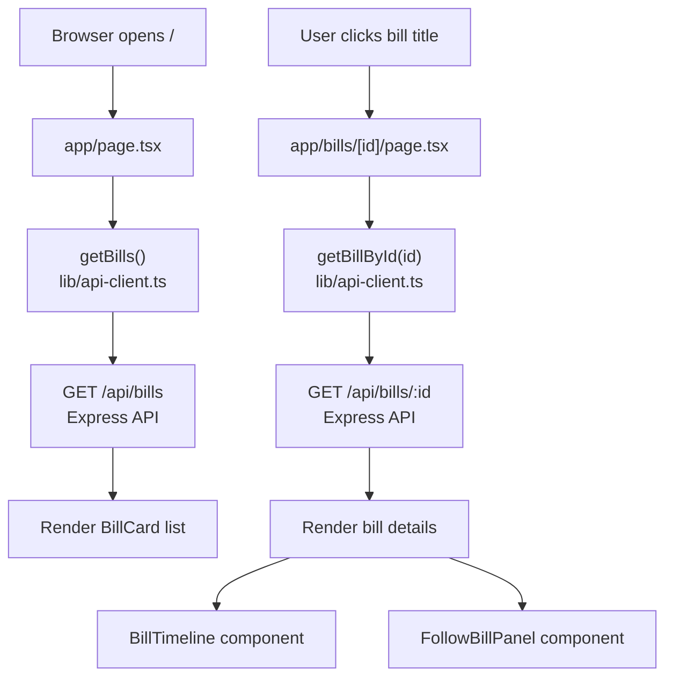

### Server Components And Client Components

The bill list and bill detail pages are primarily server-rendered pages. They fetch bill data from the backend API before rendering.

Interactive UI uses Client Components with `"use client"`.

Client Components are used for:
- login form state
- localStorage token storage
- follow/unfollow button clicks
- loading and saving states

Examples:
- `auth-panel.tsx`
- `follow-bill-panel.tsx`

### Frontend Authentication Flow

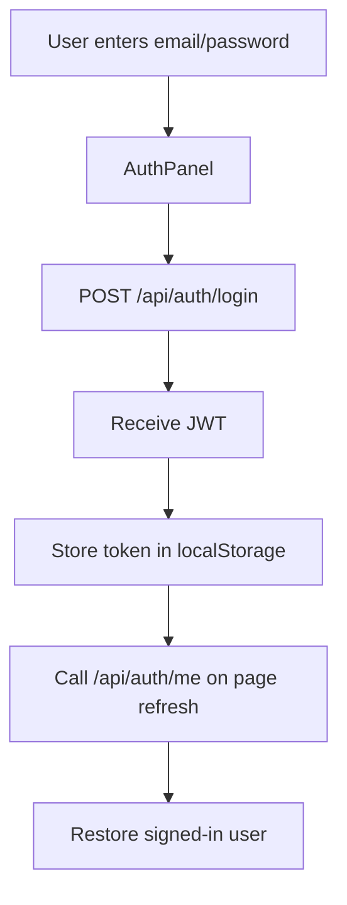

The frontend stores the JWT in `localStorage` for local development.

Protected API calls include:

```text
Authorization: Bearer TOKEN_HERE
```

This is used by:
- `GET /api/auth/me`
- `POST /api/bills/:id/follow`
- `DELETE /api/bills/:id/follow`
- `GET /api/me/follows`

### Follow UI Flow

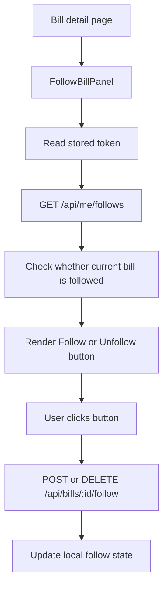

The follow UI does not trust local state alone. It refreshes follow state from the backend using `/api/me/follows`.

A React re-render loop was fixed by memoizing the auth-change callback with `useCallback`.

## Source Ingestion Architecture

The ingestion system separates source parsing from database storage.

```text
source website
  -> source adapter/parser
  -> NormalizedBillInput
  -> ingestBill()
  -> Prisma
  -> PostgreSQL
```

This lets the app support multiple sources without rewriting database logic.

### Existing Ingestion Sources

Current sources:
- manual seed data from `seed-bills.ts`
- PRS listing data from `fetch-prs-bills.ts`
- enriched PRS detail data from individual PRS bill pages

### Bill Ingestion Boundary

All bill sources are converted into:

```ts
NormalizedBillInput
```

Then saved through:

```ts
ingestBill()
```

This keeps the ingestion service source-agnostic.

The ingestion service handles:
- creating/updating bills
- creating/updating bill stages
- creating/updating bill versions
- preserving raw source metadata
- avoiding duplicates through Prisma `upsert`

### PRS Listing Ingestion

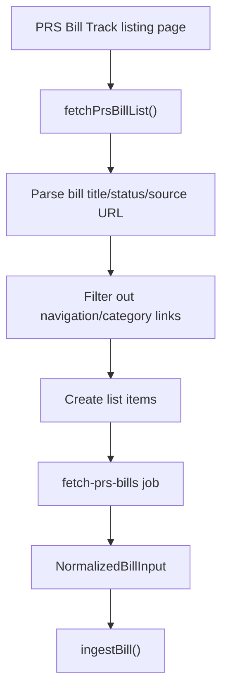

The listing parser extracts:
- title
- status
- source URL
- year from title

The parser skips:
- navigation links
- category links
- non-bill links
- links without a year-like bill slug

### PRS Detail Enrichment

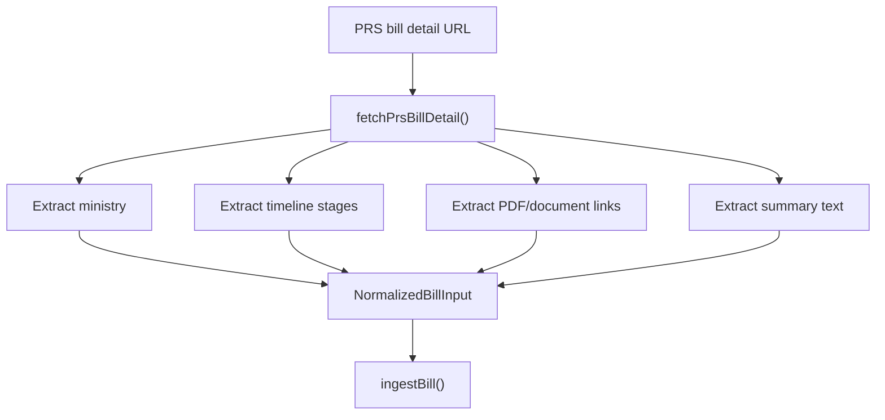

Detail enrichment extracts:
- ministry
- stage timeline
- PDF/document links
- summary text where available

Document links become bill versions with PDF URLs.

Timeline entries become bill stages.

PRS detail data is preserved in `rawSourceData`, but dates are converted to ISO strings first because JSON fields cannot store JavaScript `Date` objects directly.

### Defensive Parsing Decisions

PRS pages are HTML pages, not a formal API. They include navigation links, category links, and content sections alongside bill data.

To avoid bad ingestion, the parser:
- filters URLs to likely bill detail slugs
- requires bill-like titles with years
- skips category/navigation links
- uses fetch timeout protection
- stores raw source metadata for debugging

This makes the ingestion process safer while still allowing future parser improvements.

## PDF Text Extraction Flow

PDF text extraction prepares bill versions for deterministic diffing.

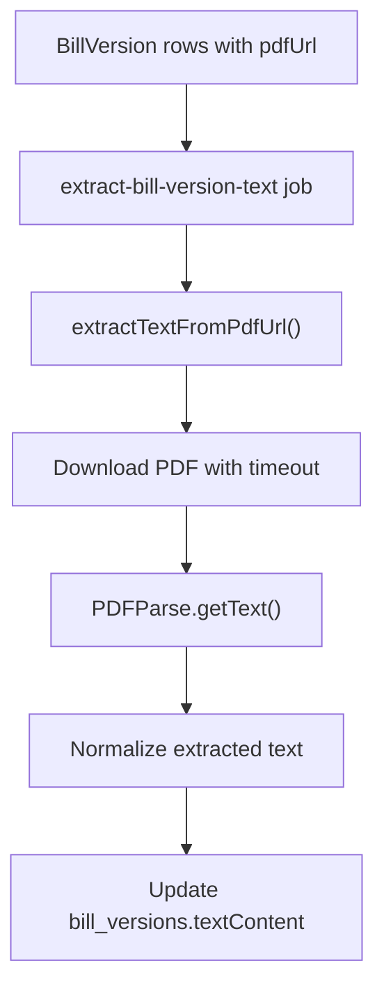

The extraction job selects bill versions where:
- `pdfUrl` exists
- `textContent` is empty

This makes the job safe to rerun.

Extracted text is stored in `bill_versions.textContent` because Day 4 diffing compares one bill version against another.

The original PDF URL is preserved for traceability.

## Deterministic Diff Flow

Diffing compares two extracted bill versions.

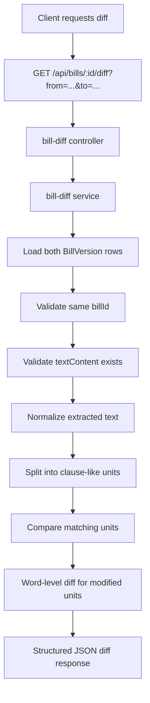

### Why Deterministic Diffing Comes Before AI

The app does not ask an LLM to decide what changed between bill versions.

Instead, the backend first performs deterministic comparison:
- normalize text
- split into clause-like units
- identify added, removed, modified, and unchanged units
- generate word-level changes for modified units

This makes the comparison reproducible and inspectable.

AI summarization can later consume this structured diff, but the source of truth remains deterministic code.

### Why Not Naive Line Diffing

Legal PDFs often contain:
- arbitrary line breaks
- wrapped clauses
- headers and footers
- spacing changes
- page-number artifacts

A naive line diff can report large changes when the legal text barely changed.

Clause-like units are more useful because legal meaning is usually organized around clauses, sections, and numbered provisions.