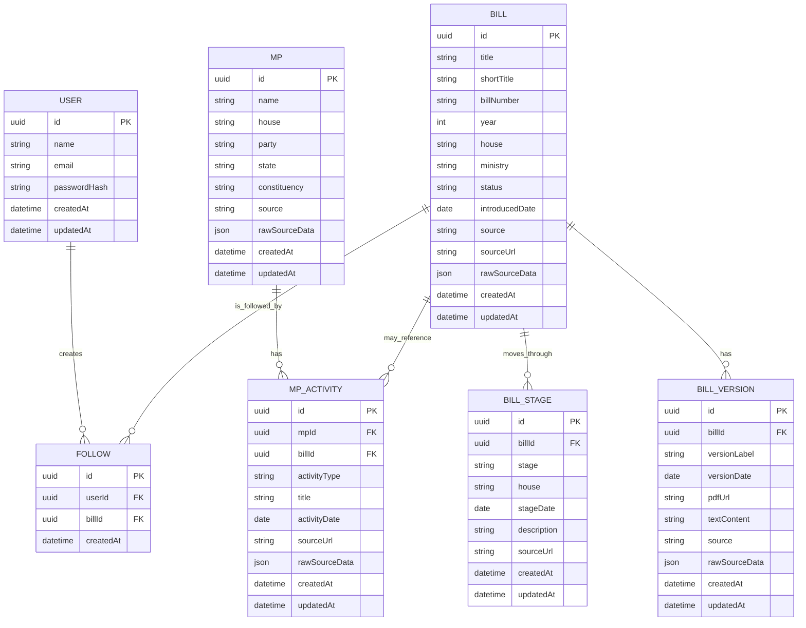
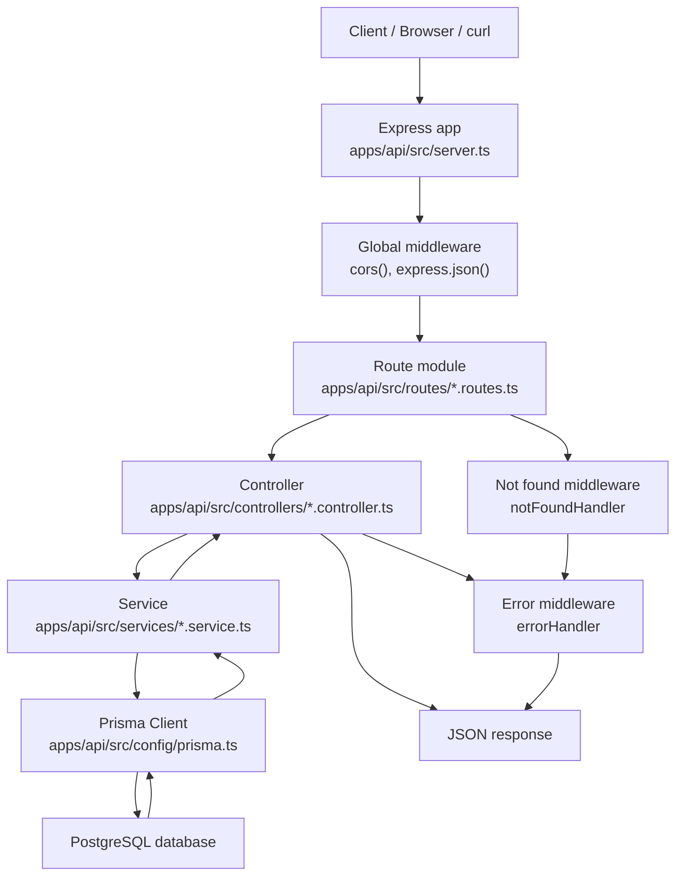

<!-- docs/architecture.md -->

# Architecture

## Database Choice

This project uses PostgreSQL with Prisma.

PostgreSQL was chosen because the core domain is relational: bills have versions, bills move through stages, users follow bills, and MP activity may reference legislative records. Prisma is used as the TypeScript ORM so database models, migrations, and queries stay type-safe and easier to maintain.

Raw scraped source data is still preserved using JSON fields where needed, so the app can keep official source payloads without forcing every scraped field into a rigid schema immediately.

## Core Database Design



## Table Responsibilities

### `bills`

Stores the main legislative bill record.

Key responsibilities:
- bill identity
- title and bill number
- house, year, ministry, and current status
- official or source URL
- raw scraped source payload

### `bill_versions`

Stores different text versions of a bill, such as introduced, amended, passed, or committee versions.

This table supports the version diffing feature.

### `bill_stages`

Stores timeline events for a bill.

Examples:
- introduced in Lok Sabha
- passed in Lok Sabha
- introduced in Rajya Sabha
- referred to committee
- received assent

### `users`

Stores application users for authentication.

Passwords are stored as hashes, never as plain text.

### `follows`

Join table connecting users to bills they follow.

A user can follow many bills, and a bill can be followed by many users.

### `mps`

Stores Member of Parliament profile data from the seed dataset.

### `mp_activity`

Stores MP-related legislative activity.

This is separate from `mps` because one MP can have many activity records, and some activity records may reference bills.

## API Request Flow

The backend uses a route-controller-service structure. Each layer has a specific responsibility, so HTTP handling, business logic, and database access stay separate.



### What Happens At Each Stage

1. The client sends an HTTP request, such as `GET /api/bills`.

2. `server.ts` receives the request through the Express app.

3. Global middleware runs first:
   - `cors()` allows frontend/backend communication.
   - `express.json()` parses JSON request bodies.

4. Express matches the request to a route module.

   Example:

   ```ts
   app.use("/api/bills", billRoutes);
   ```

   This forwards bill-related requests to `bills.routes.ts`.

5. The route file maps the HTTP method and path to a controller.

   Example:

   ```ts
   router.get("/", listBills);
   router.get("/:id", getBillDetail);
   router.get("/:id/timeline", getBillTimelineDetail);
   ```

6. The controller reads request inputs.

   Examples:
   - `req.params.id` for path parameters
   - `req.query.year` for query filters
   - `req.body` for JSON body data on POST/PUT routes

7. The controller calls a service function.

   Example:

   ```ts
   const bills = await getBills(filters);
   ```

8. The service uses Prisma to query or update PostgreSQL.

   Example:

   ```ts
   prisma.bill.findMany()
   ```

9. Prisma sends the query to PostgreSQL and returns typed data back to the service.

10. The controller sends a JSON response.

    Example:

    ```json
    {
      "data": []
    }
    ```

11. If no route matches, `notFoundHandler` creates a 404 error.

12. If any controller or service throws an error, `errorHandler` returns a consistent JSON error response.

    Example:

    ```json
    {
      "error": {
        "message": "Bill not found",
        "statusCode": 404
      }
    }
    ```

## Backend Folder Responsibilities

The API is organized by responsibility so routes, request handling, business logic, and database access do not all live in one file.

### `apps/api/src/server.ts`

Application entrypoint.

Responsibilities:
- creates the Express app
- registers global middleware such as CORS and JSON parsing
- mounts route modules
- registers not-found and error handlers
- starts the server on the configured port

Every incoming HTTP request enters the Express app through `server.ts`.

### `apps/api/src/config`

Configuration and shared infrastructure.

Current files:
- `env.ts`: loads and validates environment variables using `dotenv` and `zod`
- `prisma.ts`: creates and exports the shared Prisma client

This keeps environment access and database client setup out of route and controller files.

### `apps/api/src/routes`

URL definitions.

Route files decide which controller function handles each HTTP method and path.

Example:

```ts
router.get("/", listBills);
router.get("/:id", getBillDetail);
router.get("/:id/timeline", getBillTimelineDetail);
```

When mounted in `server.ts` like this:

```ts
app.use("/api/bills", billRoutes);
```

the final API paths become:

```text
GET /api/bills
GET /api/bills/:id
GET /api/bills/:id/timeline
```

### `apps/api/src/controllers`

HTTP request and response handling.

Controllers:
- read route params from `req.params`
- read query params from `req.query`
- validate simple request inputs
- call service functions
- return JSON responses
- pass errors to the centralized error middleware

Controllers should not contain raw database queries. They coordinate HTTP-level behavior.

### `apps/api/src/services`

Business logic and database access.

Services:
- use Prisma to query or update PostgreSQL
- contain reusable app logic
- are independent of Express request and response objects

Example request path:

```text
GET /api/bills
  -> bills.routes.ts
  -> listBills controller
  -> getBills service
  -> prisma.bill.findMany()
  -> PostgreSQL
```

Keeping services separate makes the code easier to test and reuse.

### `apps/api/src/middleware`

Reusable Express middleware.

Current file:
- `error.middleware.ts`

Responsibilities:
- creates `AppError` for expected application errors
- handles unknown routes
- returns consistent JSON error responses

### `apps/api/src/jobs`

Scripts that run outside normal HTTP request/response flow.

Current job files:
- `seed-bills.ts`: seeds initial bill, stage, and version data
- `seed-mps.ts`: seeds initial MP profile and activity data
The seed job:
- creates initial bill data for development
- calls the bill ingestion service
- uses Prisma upsert logic so repeated runs do not create duplicate records

Jobs are useful for scraping, scheduled fetches, seeding, and background processing.

### `apps/api/prisma`

Database schema and migrations.

Current files:
- `schema.prisma`: Prisma models and relationships
- `migrations/`: SQL migration history generated by Prisma

The Prisma schema defines the database tables, fields, relationships, indexes, and uniqueness rules.