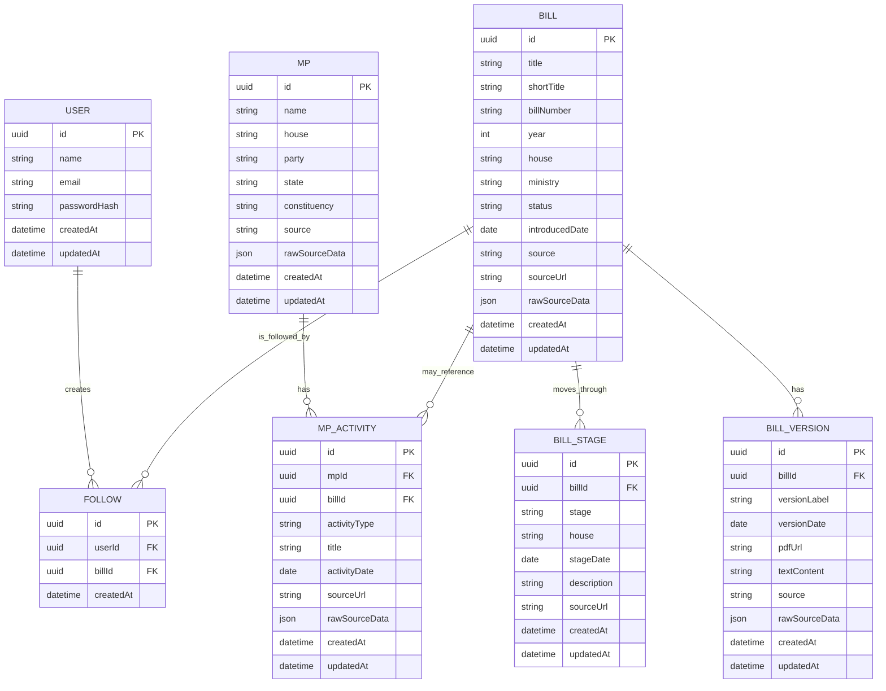

<!-- docs/architecture.md -->

# Architecture

## Database Choice

This project uses PostgreSQL with Prisma.

PostgreSQL was chosen because the core domain is relational: bills have versions, bills move through stages, users follow bills, and MP activity may reference legislative records. Prisma is used as the TypeScript ORM so database models, migrations, and queries stay type-safe and easier to maintain.

Raw scraped source data is preserved using JSON fields where needed, so the app can keep official source payloads without forcing every scraped field into a rigid schema immediately.

## Core Database Design

## Table Responsibilities

### `bills`

Stores the main legislative bill record.

Key responsibilities:
- bill identity
- title and bill number
- house, year, ministry, and current status
- official or source URL
- raw scraped source payload

### `bill_versions`

Stores different text versions of a bill, such as introduced, amended, passed, or committee versions.

This table supports the version diffing feature.

### `bill_stages`

Stores timeline events for a bill.

Examples:
- introduced in Lok Sabha
- passed in Lok Sabha
- introduced in Rajya Sabha
- referred to committee
- received assent

### `users`

Stores application users for authentication.

Passwords are stored as hashes, never as plain text.

### `follows`

Join table connecting users to bills they follow.

A user can follow many bills, and a bill can be followed by many users.

### `mps`

Stores Member of Parliament profile data from the seed dataset.

### `mp_activity`

Stores MP-related legislative activity.

This is separate from `mps` because one MP can have many activity records, and some activity records may reference bills.