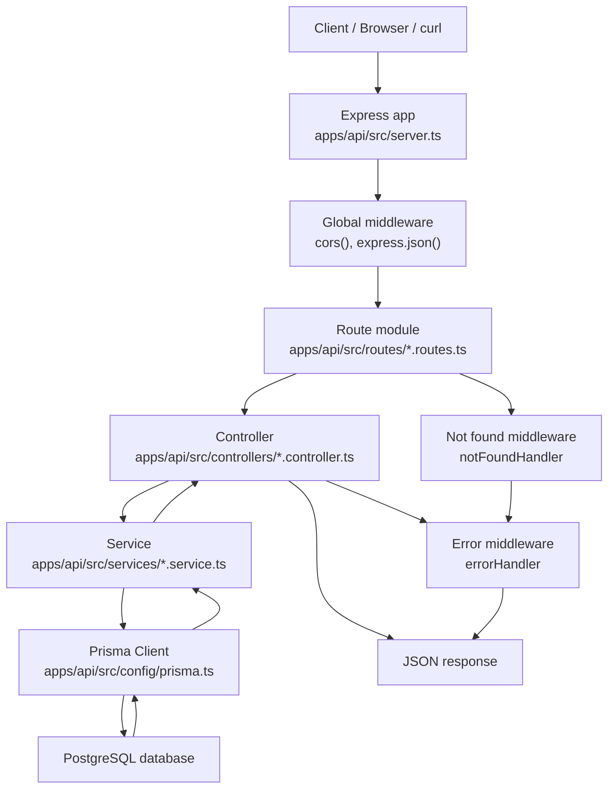

# Backend Folder Responsibilities

The API is organized by responsibility so routes, request handling, business logic, database access, and background jobs do not all live in one file.

### `apps/api/src/server.ts`

Application entrypoint.

Responsibilities:
- creates the Express app
- registers global middleware such as CORS and JSON parsing
- mounts route modules
- registers not-found and error handlers
- starts the server on the configured port

Every incoming HTTP request enters the Express app through `server.ts`.

### `apps/api/src/config`

Configuration and shared infrastructure.

Current files:
- `env.ts`: loads and validates environment variables using `dotenv` and `zod`
- `prisma.ts`: creates and exports the shared Prisma client

This keeps environment access and database client setup out of route, controller, and service files.

### `apps/api/src/routes`

URL definitions.

Route files decide which controller function handles each HTTP method and path.

Examples:

```ts
router.get("/", listBills);
router.get("/:id", getBillDetail);
router.get("/:id/timeline", getBillTimelineDetail);
```

When mounted in `server.ts` like this:

```ts
app.use("/api/bills", billRoutes);
```

the final API paths become:

```text
GET /api/bills
GET /api/bills/:id
GET /api/bills/:id/timeline
```

### `apps/api/src/controllers`

HTTP request and response handling.

Controllers:
- read route params from `req.params`
- read query params from `req.query`
- read JSON bodies from `req.body`
- validate request input
- call service functions
- return JSON responses
- pass errors to centralized error middleware

Controllers should not contain raw database queries. They coordinate HTTP-level behavior.

### `apps/api/src/services`

Business logic and database access.

Services:
- use Prisma to query or update PostgreSQL
- contain reusable app logic
- stay independent of Express request and response objects

Example request path:

```text
GET /api/bills
  -> bills.routes.ts
  -> listBills controller
  -> getBills service
  -> prisma.bill.findMany()
  -> PostgreSQL
```

Keeping services separate makes the code easier to test, reuse, and explain.

### `apps/api/src/middleware`

Reusable Express middleware.

Current files:
- `error.middleware.ts`: creates `AppError`, handles unknown routes, and returns consistent JSON errors
- `auth.middleware.ts`: verifies JWTs and attaches the authenticated user to `req.user`

Middleware runs before or after controllers depending on its purpose.

### `apps/api/src/jobs`

Scripts that run outside the normal HTTP request/response flow.

Current job files:
- `seed-bills.ts`: seeds initial bill, stage, and version data
- `seed-mps.ts`: seeds initial MP profile and activity data

Jobs are useful for scraping, scheduled fetches, seeding, and background processing.

### `apps/api/prisma`

Database schema and migrations.

Current files:
- `schema.prisma`: Prisma models, fields, relationships, indexes, and unique constraints
- `migrations/`: SQL migration history generated by Prisma

The Prisma schema is the source of truth for the database structure.

# API Request Flow

The backend uses a route-controller-service structure. Each layer has a specific responsibility, so HTTP handling, business logic, and database access stay separate.



### What Happens At Each Stage

1. The client sends an HTTP request, such as `GET /api/bills`.

2. `server.ts` receives the request through the Express app.

3. Global middleware runs first:
   - `cors()` allows frontend/backend communication.
   - `express.json()` parses JSON request bodies.

4. Express matches the request to a route module.

   Example:

   ```ts
   app.use("/api/bills", billRoutes);
   ```

5. The route file maps the HTTP method and path to a controller.

   Example:

   ```ts
   router.get("/", listBills);
   router.get("/:id", getBillDetail);
   router.get("/:id/timeline", getBillTimelineDetail);
   ```

6. The controller reads request inputs from `req.params`, `req.query`, or `req.body`.

7. The controller calls a service function.

   Example:

   ```ts
   const bills = await getBills(filters);
   ```

8. The service uses Prisma to query or update PostgreSQL.

   Example:

   ```ts
   prisma.bill.findMany()
   ```

9. Prisma sends the query to PostgreSQL and returns typed data back to the service.

10. The controller sends a JSON response.

    Example:

    ```json
    {
      "data": []
    }
    ```

11. If no route matches, `notFoundHandler` creates a 404 error.

12. If any controller or service throws an error, `errorHandler` returns a consistent JSON error response.

    Example:

    ```json
    {
      "error": {
        "message": "Bill not found",
        "statusCode": 404
      }
    }
    ```
