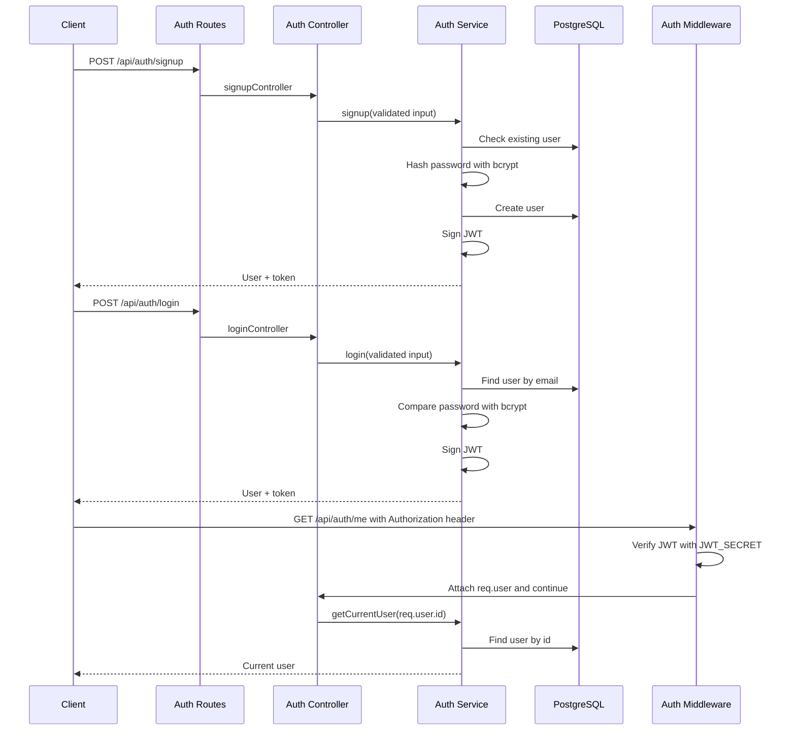
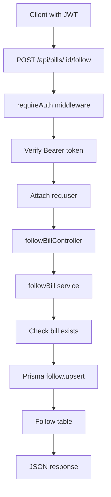

## Authentication And Authorization Flow

The backend uses JWT-based authentication.

Authentication answers:

```text
Who is this user?
```

Authorization answers:

```text
Is this user allowed to access this route or resource?
```

At this stage, the app has authentication and route protection. More specific authorization rules can be added later.



### Signup

The signup flow:

1. Client sends `name`, `email`, and `password`.
2. Controller validates the request body with Zod.
3. Service checks whether the email already exists.
4. Password is hashed with bcrypt.
5. User is stored in PostgreSQL.
6. A JWT is signed and returned with the safe user object.

The plain password is never stored.

### Login

The login flow:

1. Client sends `email` and `password`.
2. Controller validates the request body with Zod.
3. Service finds the user by email.
4. bcrypt compares the submitted password with the stored password hash.
5. If valid, the backend signs a JWT.
6. The client receives the safe user object and token.

For invalid credentials, the API returns a generic error:

```text
Invalid email or password
```

This avoids revealing whether an email exists.

### What The JWT Contains

The JWT payload currently contains:

```json
{
  "sub": "user-id",
  "email": "user@example.com"
}
```

`sub` means subject and stores the authenticated user's ID.

The token is signed using `JWT_SECRET`, which is loaded from environment variables. The secret is not committed to Git.

The token also has an expiration time:

```text
7 days
```

### How Protected Routes Work

Protected routes use the `requireAuth` middleware.

The client sends the token in the `Authorization` header:

```text
Authorization: Bearer TOKEN_HERE
```

The middleware:

1. Reads the `Authorization` header.
2. Confirms it starts with `Bearer`.
3. Extracts the token.
4. Verifies the token using `JWT_SECRET`.
5. Reads the user ID from `sub`.
6. Attaches the authenticated user to `req.user`.
7. Allows the request to continue.

If the token is missing, invalid, or expired, the middleware returns `401 Unauthorized`.

Example protected request flow:

```text
GET /api/auth/me
  -> requireAuth middleware
  -> verify JWT
  -> attach req.user
  -> getMeController
  -> getCurrentUser service
  -> PostgreSQL
  -> JSON response
```

### Why JWT Is Useful Here

JWT lets the frontend authenticate once, store the token, and send it with later requests.

This is useful for features like:
- viewing the current logged-in user
- following bills
- listing followed bills
- sending notifications to users who follow a bill

The backend still checks the database for `/api/auth/me`, so deleted users or stale tokens do not return outdated user data.

## Follow Route Flow

Follow routes are protected user-specific actions.



### Follow

The follow endpoint is:

```text
POST /api/bills/:id/follow
```

It uses the authenticated user ID from `req.user`, not from the request body.

This prevents one user from following bills on behalf of another user.

The service uses the compound unique key:

```prisma
@@unique([userId, billId])
```

and Prisma `upsert`, so following the same bill more than once does not create duplicate rows.

### Unfollow

The unfollow endpoint is:

```text
DELETE /api/bills/:id/follow
```

It uses `deleteMany` with both `userId` and `billId`.

This makes unfollow safe to retry. If the follow row does not exist, the request still completes without crashing.

### My Follows

The current-user follows endpoint is:

```text
GET /api/me/follows
```

It returns all bills followed by the authenticated user, including selected bill details needed by the frontend.
