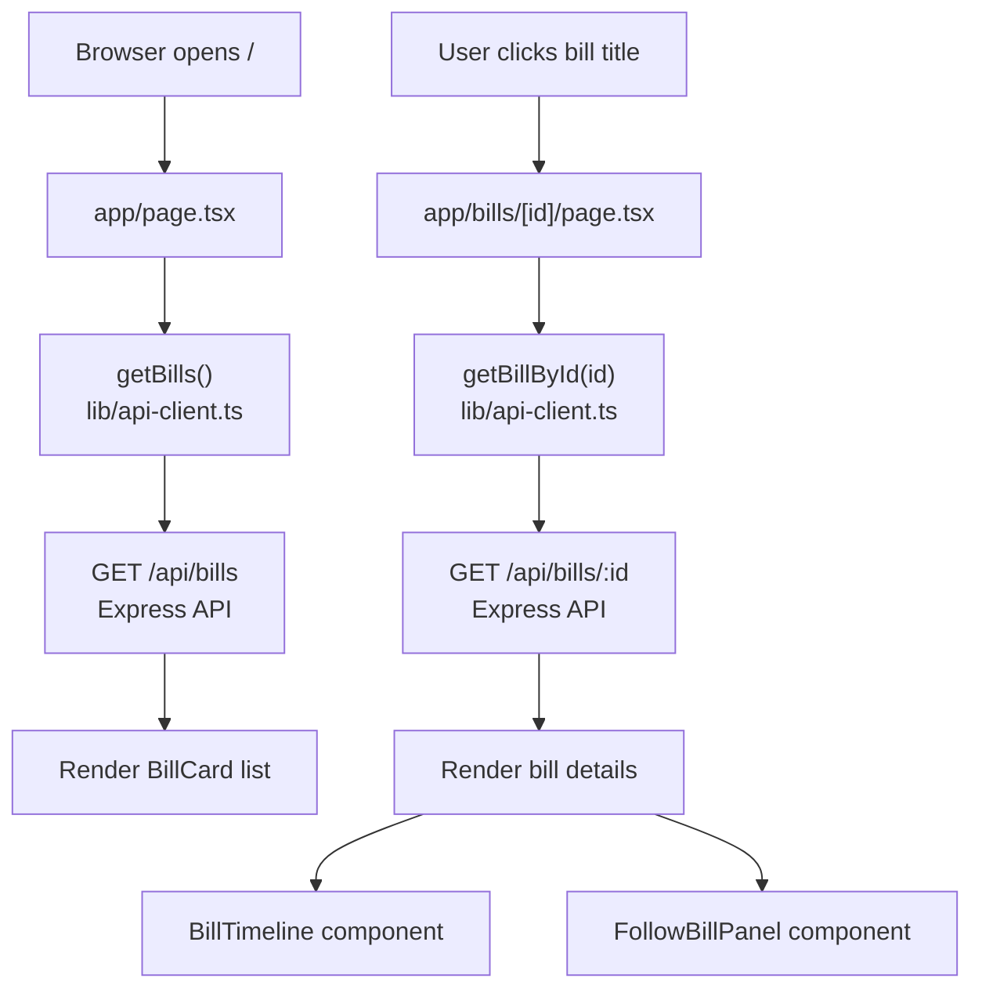
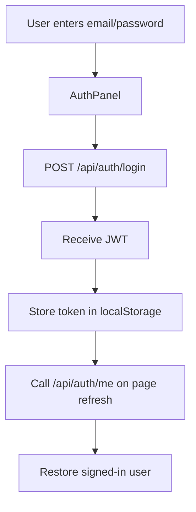
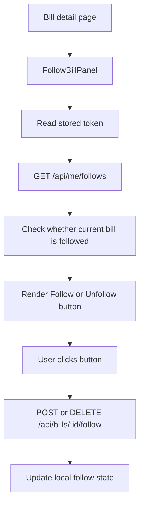

## Frontend Architecture

The frontend is a Next.js app inside `apps/web`.

The frontend does not connect to PostgreSQL directly. It communicates with the Express backend through HTTP APIs.

```text
Next.js frontend
  -> Express API
  -> Prisma
  -> PostgreSQL
```

### Frontend Folder Responsibilities

#### `apps/web/app`

Next.js App Router routes and layouts.

Current important files:
- `layout.tsx`: root layout shared by all pages
- `page.tsx`: bill list homepage at `/`
- `bills/[id]/page.tsx`: dynamic bill detail page at `/bills/:id`
- `globals.css`: global styling and shared utility classes

#### `apps/web/components`

Reusable UI components.

Current components:
- `bill-card.tsx`: displays one bill in the bill list
- `bill-timeline.tsx`: renders visual stage timeline for a bill
- `auth-panel.tsx`: handles login/logout UI and token persistence
- `follow-bill-panel.tsx`: handles follow/unfollow interaction for one bill

#### `apps/web/lib`

Frontend utilities and API clients.

Current file:
- `api-client.ts`: centralizes calls from the frontend to the Express API

The API client reads the backend base URL from:

```env
NEXT_PUBLIC_API_BASE_URL=http://localhost:4000
```

### Frontend Page Flow



### Server Components And Client Components

The bill list and bill detail pages are primarily server-rendered pages. They fetch bill data from the backend API before rendering.

Interactive UI uses Client Components with `"use client"`.

Client Components are used for:
- login form state
- localStorage token storage
- follow/unfollow button clicks
- loading and saving states

Examples:
- `auth-panel.tsx`
- `follow-bill-panel.tsx`

### Frontend Authentication Flow



The frontend stores the JWT in `localStorage` for local development.

Protected API calls include:

```text
Authorization: Bearer TOKEN_HERE
```

This is used by:
- `GET /api/auth/me`
- `POST /api/bills/:id/follow`
- `DELETE /api/bills/:id/follow`
- `GET /api/me/follows`

### Follow UI Flow



The follow UI does not trust local state alone. It refreshes follow state from the backend using `/api/me/follows`.

A React re-render loop was fixed by memoizing the auth-change callback with `useCallback`.

### Frontend Route Additions

Day 5 adds and fixes several frontend routes:

Important frontend components:
- `FollowedBillsList`: loads followed bills for the logged-in user
- `NotificationList`: loads notifications and handles mark-as-read
- `AiDiffSummaryPanel`: compares two text versions and requests AI summary
- `AuthPanel`: handles login/logout and token storage
- `ThemeToggle`: switches between light and dark themes

### Frontend Notification Flow

~~~mermaid
flowchart TD
    A["User opens /me/notifications"] --> B["NotificationList component"]
    B --> C["Read JWT from localStorage"]
    C --> D["GET /api/me/notifications"]
    D --> E["Render notification cards"]
    E --> F["Unread notification shows Unread badge"]
    F --> G["User clicks Mark as read"]
    G --> H["PATCH /api/me/notifications/:id/read"]
    H --> I["Update local notification state"]
~~~

The notification page is a Client Component because it needs browser-local JWT access and button interactions.