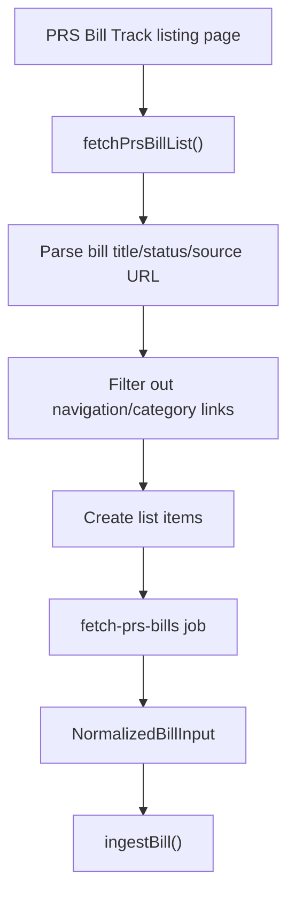
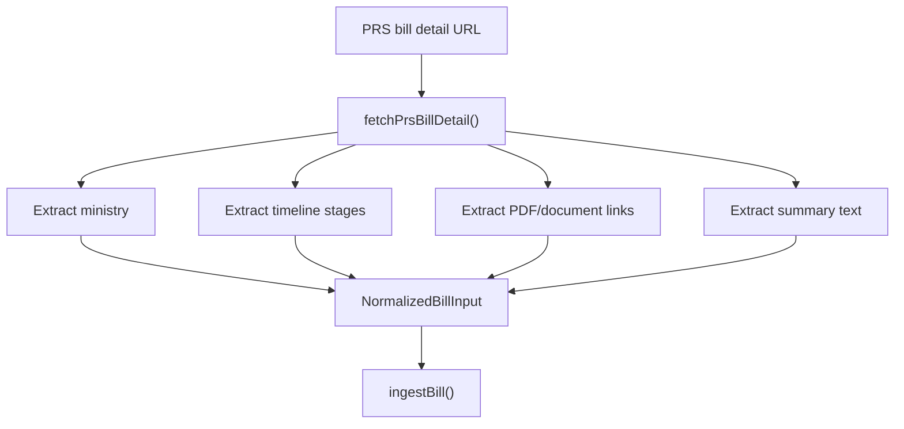
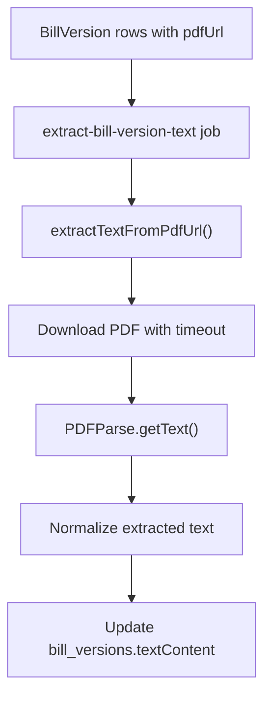

## Source Ingestion Architecture

The ingestion system separates source parsing from database storage.

```text
source website
  -> source adapter/parser
  -> NormalizedBillInput
  -> ingestBill()
  -> Prisma
  -> PostgreSQL
```

This lets the app support multiple sources without rewriting database logic.

### Existing Ingestion Sources

Current sources:
- manual seed data from `seed-bills.ts`
- PRS listing data from `fetch-prs-bills.ts`
- enriched PRS detail data from individual PRS bill pages

### Bill Ingestion Boundary

All bill sources are converted into:

```ts
NormalizedBillInput
```

Then saved through:

```ts
ingestBill()
```

This keeps the ingestion service source-agnostic.

The ingestion service handles:
- creating/updating bills
- creating/updating bill stages
- creating/updating bill versions
- preserving raw source metadata
- avoiding duplicates through Prisma `upsert`

### PRS Listing Ingestion



The listing parser extracts:
- title
- status
- source URL
- year from title

The parser skips:
- navigation links
- category links
- non-bill links
- links without a year-like bill slug

### PRS Detail Enrichment



Detail enrichment extracts:
- ministry
- stage timeline
- PDF/document links
- summary text where available

Document links become bill versions with PDF URLs.

Timeline entries become bill stages.

PRS detail data is preserved in `rawSourceData`, but dates are converted to ISO strings first because JSON fields cannot store JavaScript `Date` objects directly.

### Defensive Parsing Decisions

PRS pages are HTML pages, not a formal API. They include navigation links, category links, and content sections alongside bill data.

To avoid bad ingestion, the parser:
- filters URLs to likely bill detail slugs
- requires bill-like titles with years
- skips category/navigation links
- uses fetch timeout protection
- stores raw source metadata for debugging

This makes the ingestion process safer while still allowing future parser improvements.

## PDF Text Extraction Flow

PDF text extraction prepares bill versions for deterministic diffing.



The extraction job selects bill versions where:
- `pdfUrl` exists
- `textContent` is empty

This makes the job safe to rerun.

Extracted text is stored in `bill_versions.textContent` because Day 4 diffing compares one bill version against another.

The original PDF URL is preserved for traceability.