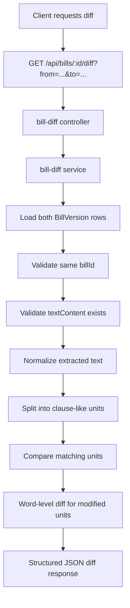
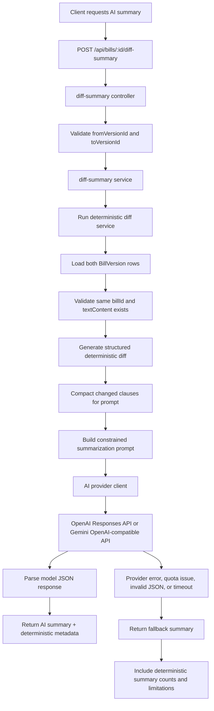

## Deterministic Diff Flow

Diffing compares two extracted bill versions.



### Why Deterministic Diffing Comes Before AI

The app does not ask an LLM to decide what changed between bill versions.

Instead, the backend first performs deterministic comparison:
- normalize text
- split into clause-like units
- identify added, removed, modified, and unchanged units
- generate word-level changes for modified units

This makes the comparison reproducible and inspectable.

AI summarization can later consume this structured diff, but the source of truth remains deterministic code.

### Why Not Naive Line Diffing

Legal PDFs often contain:
- arbitrary line breaks
- wrapped clauses
- headers and footers
- spacing changes
- page-number artifacts

A naive line diff can report large changes when the legal text barely changed.

Clause-like units are more useful because legal meaning is usually organized around clauses, sections, and numbered provisions.

## AI Diff Summary Flow

AI summarization runs after deterministic diffing.



The AI layer does not decide what changed. It receives structured deterministic diff data and explains it in plain English.

The source of truth remains:

```text
deterministic diff service
```

The model receives a compact JSON payload containing:
- source bill ID
- from-version metadata
- to-version metadata
- deterministic added/removed/modified/unchanged counts
- changed clause-like units
- before/after text snippets for changed units

The prompt instructs the model to:
- use only the provided diff JSON
- avoid invented legal effects, motives, or implications
- mention uncertainty when the diff text is incomplete
- cite clause headings exactly from the deterministic diff
- return valid JSON only

The expected model output shape is:

```json
{
  "summary": "Plain-English summary in 4-8 sentences.",
  "keyChanges": [
    {
      "clause": "Clause or heading from diff",
      "changeType": "added | removed | modified",
      "explanation": "Plain-English explanation based only on before/after text."
    }
  ],
  "limitations": ["Any important limitations or missing context."]
}
```

The API response also includes deterministic metadata:

```json
{
  "deterministicSummary": {
    "added": 0,
    "removed": 0,
    "modified": 0,
    "unchanged": 0
  },
  "fromVersion": {
    "id": "...",
    "label": "...",
    "pdfUrl": "..."
  },
  "toVersion": {
    "id": "...",
    "label": "...",
    "pdfUrl": "..."
  },
  "usedAi": true,
  "aiProvider": "gemini",
  "aiModel": "..."
}
```

If the AI provider fails, times out, returns invalid JSON, or has quota issues, the endpoint still returns:
- deterministic diff summary counts
- version metadata
- a fallback explanation
- limitations explaining why AI output was unavailable

This keeps the core diff feature usable even when the AI provider is unavailable.

## UI And Notification Additions

### AI-Ready Bill Discovery

The app includes an AI-ready discovery flow so users can quickly find bills that can be compared and summarized.

A bill is considered AI-ready when it has at least two bill versions where `textContent` exists.

~~~mermaid
flowchart TD
    A["Frontend homepage or follows page"] --> B["GET /api/ai-ready-bills"]
    B --> C["AI-ready bills controller"]
    C --> D["AI-ready bills service"]
    D --> E["Find BillVersion rows with textContent"]
    E --> F["Group versions by billId"]
    F --> G["Keep bills with 2+ text versions"]
    G --> H["Return bills with comparable versions"]
    H --> I["Render AI-ready cards"]
    I --> J["User opens bill detail page"]
    J --> K["AI summary panel can compare versions"]
~~~

This avoids forcing users to manually inspect the database for bills that support AI summarization.

### Demo Data Policy

The project uses real PRS/Sansad-style ingestion as the primary data path.

A clearly labelled demo bill is also included for local testing and portfolio demos:

~~~text
Demo Urban Water Security Bill, 2026
~~~

The demo bill exists because real scraped data may not always contain two clean text-extracted versions at demo time. It does not replace real source ingestion. It gives evaluators a reliable way to test deterministic diffing and AI-assisted summarization.

Demo records are marked with:

~~~text
source = "demo"
~~~

This keeps demo data distinguishable from official or PRS-sourced records.